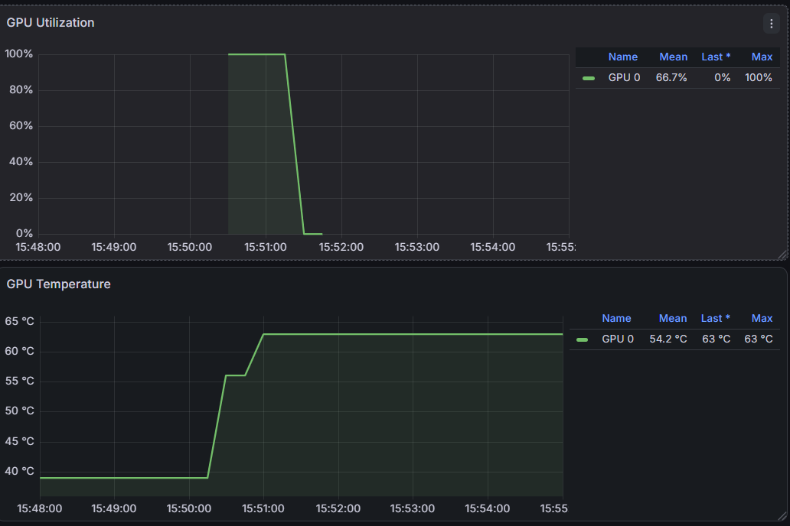

# gpu-monitoring-lab

Hands-on lab to learn how GPU systems are built and run: describing hardware architectures and how the components connect, GPU drivers, monitoring (Prometheus, Grafana, DCGM) and cloud-native deployment.

Setup: my laptop (i7-13620H, 16 GB RAM, RTX 4060 Laptop GPU), Ubuntu on WSL2, Docker.

## Session 1: hardware inventory

Raw outputs are in [hardware/](hardware/).

### CPU (`lscpu`, `lstopo`)
- 1 socket, 1 NUMA node. Each core has its own L1 (instructions + data) and L2; all cores share the 24 MB L3.
- Speed order: L1 (fastest, smallest) → L2 → L3 (largest, shared) → RAM.
- The real chip is hybrid: 6 P-cores (2 threads each) + 4 E-cores (1 thread each) = 10 cores / 16 threads.
- **WSL difference:** the hypervisor shows 8 identical cores × 2 threads, and WSL only gets ~8 GB of the 16 GB RAM (default WSL config). Inside a VM, tools show what the hypervisor allows.

### GPU (`lspci`, `nvidia-smi`)
- NVIDIA GeForce RTX 4060 Laptop GPU (Ada Lovelace), 8 GB VRAM, 45 W power limit, PCIe Gen4 x8.
- Driver 610.78, supports CUDA up to 13.3.
- No ECC, no MIG, no NVLink: these are datacenter GPU features.
- **WSL difference:** `lspci` shows only "Microsoft Basic Render Driver" and Virtio devices, with PCI addresses that change on every reboot. WSL does not see the GPU as a PCIe device; it uses it through the Windows driver (GPU paravirtualization, libraries in `/usr/lib/wsl/lib`).

### Topology (`nvidia-smi topo -m`)
- Shows how GPUs connect to each other (NVLink, PCIe switch, host bridge, across sockets) and which CPU cores and NUMA node each GPU belongs to.
- On a multi-GPU server it is used to place jobs on close GPUs and on the CPU cores of the same NUMA node, and to spot broken links (e.g. `SYS` where `NV18` is expected).
- On my laptop it shows only `GPU0 X`: one GPU, and WSL hides the CPU/NUMA affinity.

### Finding: GPU in Docker failed
```
docker run --rm --gpus all nvidia/cuda:12.6.0-base-ubuntu24.04 nvidia-smi
→ nvidia-container-cli: load library failed: libnvidia-ml.so.1: cannot open shared object file
```
- Two Docker engines were installed: `docker.io` (apt) and `docker` (snap). The snap one was serving the Docker socket.
- The snap runs in a sandbox, so its NVIDIA hook could not reach the driver library in `/usr/lib/wsl/lib`.
- Lesson: check which installation is actually running (`docker info`, `snap list`, `dpkg -l`) before debugging further.
- Fix: see Session 2.

## Session 2: GPU in Docker

### Fix
- Removed the snap engine (`snap remove --purge docker`) and kept apt `docker.io`. `--purge` skips the automatic snapshot of its data.
- Before removing, checked what would be lost: all images, containers and volumes lived in the snap's storage (`docker info` → `/var/snap/docker/...`). Images are rebuildable; volumes are data. Nothing needed a backup (production DB is hosted, Grafana dashboard is in the repo).
- The removal also deleted `/run/docker.sock`: the daemon was running, but the client could not connect. Fixed with `systemctl restart docker.socket docker`. Data now in `/var/lib/docker`.
- Installed the NVIDIA Container Toolkit and registered it with `nvidia-ctk runtime configure --runtime=docker` (writes `/etc/docker/daemon.json`). The toolkit is not a driver: it exposes the host's driver and GPU to containers. In WSL the driver comes from Windows, so no Linux driver is installed.

### Result
`nvidia-smi` now runs inside a CUDA 12.6 container ([output](hardware/docker-gpu-test.txt)).
- `KMD Version 610.78` = the kernel-mode driver (on Windows). `CUDA UMD Version 13.3` = the highest CUDA version it supports.
- Rule: the driver's CUDA version must be ≥ the container's CUDA version (13.3 ≥ 12.6). Newer drivers run older CUDA, not the other way round.

## Session 3: monitoring (Prometheus + DCGM + Grafana)

### Finding: no DNS in WSL
- `docker pull` failed: names did not resolve, but `ping 8.8.8.8` worked. So the network was fine and only DNS was broken.
- Cause: `dnsTunneling=false` in the Windows file `%USERPROFILE%\.wslconfig`. WSL then asks a DNS proxy on the Windows host (`nameserver 172.17.176.1`), which did not answer.
- Fix: `dnsTunneling=true` + `wsl --shutdown`. DNS queries now go through Windows' own network stack.
- Lesson: test by IP first, then by name. That separates "network down" from "DNS down".

### Stack
All in [monitoring/](monitoring/), started with `docker compose up -d`:

| Service | Port | Job |
|---|---|---|
| `node-exporter` | 9100 | CPU, RAM, disk, network of the machine |
| `dcgm-exporter` | 9400 | GPU metrics via NVIDIA DCGM (`gpus: all` → NVIDIA Container Toolkit) |
| `prometheus` | 9090 | Scrapes both exporters every 15 s and stores the time series ([config](monitoring/prometheus.yml)) |
| `grafana` | 3000 | Dashboards. The Prometheus datasource is provisioned from a [file](monitoring/grafana/datasource.yml) |

- Prometheus pulls (scrapes) from exporters. Targets are service names (`dcgm-exporter:9400`), resolved by Docker's internal DNS.
- Dashboard: NVIDIA DCGM Exporter Dashboard (Grafana ID 12239), imported by hand for now.
- WSL notes: node-exporter's `/:/host:ro,rslave` mount fails (`/` is not a shared mount in WSL), so it uses `/:/host:ro`. DCGM works in WSL.

### Load test
`nbody` CUDA sample (1M bodies, ~1 min) at 15:50:



- Utilization 0 → 100 %, temperature 39 → 63 °C, power ~45 W (= the GPU's power limit).

### Finding: don't trust every number
- Idle power showed **590 W** and **1 W** on a 45 W GPU. Values under load were realistic, so the idle readings are invalid (likely the GPU's deep power-saving state in WSL).
- After the run, temperature stayed flat at 63 °C for 7 minutes and utilization had gaps: probably the last value repeated while the GPU slept.
- Lesson: sanity-check metrics against physical limits. On a real server, compare with `nvidia-smi` and the BMC's power reading before trusting a dashboard.

## Roadmap
- [x] Session 1: hardware inventory
- [x] Session 2: GPU in Docker (snap engine removed, NVIDIA Container Toolkit)
- [ ] Drivers: how drivers work on Linux servers (kernel modules, DKMS, driver/CUDA versions), NVIDIA GPU Operator
- [x] Session 3: monitoring with Prometheus + node_exporter + DCGM exporter → Grafana (WSL DNS fixed first)
- [ ] Grafana dashboard as code (provisioned JSON instead of a manual import)
- [ ] Cloud-native: run the monitoring stack on kind/k3s
